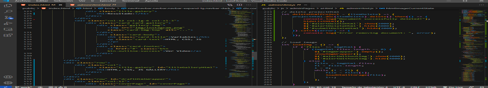

# INTRODUCCIÓN A LA PROGRAMACIÓN :computer:	

:eyes: :point_right: **Si no tienes conocimientos de programación, esta guía puede ayudarte a comprender los fundamentos necesarios que te permitirá crear programas de computadora.**

:heavy_check_mark: :point_right: *Continúa con la [Introducción](https://github.com/DeveloperLuisF3/introduccionALaProgramacion/tree/main/introduccion.md "Ir a la introducción")* 

- - -

### Contenido:

1. [Introducción](https://github.com/DeveloperLuisF3/introduccionALaProgramacion/tree/main/introduccion.md "Ir a la introducción")
    * Introducción
    * ¿Qué es la programación?
    * Beneficios de la programación
    * Importancia de la programación
    * Referencias+ 
 