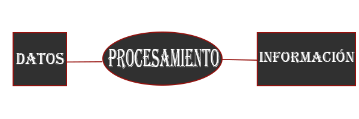

# 2.2.1 Introducción

:heavy_check_mark: :eyes: :point_right: **Algoritmo como herramienta.**

- - -

### Contenido:

* Introducción

- - -

## Introducción

Un **algoritmo** es una serie de pasos ordenados lógicamente que permiten resolver un problema. En la vida diaria podemos encontrar muchos ejemplos de algoritmos, como en:

* Una receta de cocina.
* El instructivo para el correcto funcionamiento de un dispositivo electrónico.
* El instructivo para construir un lego.
* Los pasos para construir un edificio.

Incluso en actividades comunes como:

* Caminar.
* Escribir.
* Beber agua.

Los ejemplos anteriores tienen en común que la lista de instrucciones tienen un orden lógico lo cual permite resolver un problema ya sea preparar un platillo culinario, disfrutar al 100% el funcionamiento de un dispositivo electrónico, construir un robot lego o construir un edificio. 

Un error en el orden de las instrucciones podría no resolver el problema y dejar inservible el algoritmo.

Por ejemplo: En la acción de beber agua, si levantamos el vaso y lo dirigimos hacia la boca antes de verter agua en el vaso no podremos beber agua y moriremos de sed. En realidad no, antes de tocar el vaso con la boca podríamos reaccionar y volver a intentarlo en el orden correcto y resolver la situación, pero si queremos resolver problemas con ayuda de una computadora es importante considerar el orden de las instrucciones, la computadora solo realiza las instrucciones que se le indiquen, por eso la importancia de diseñar instrucciones ordenadas, detalladas y no ambiguas.

Mantener un orden en los pasos o instrucciones asegura el correcto funcionamiento del algoritmo, incluso a partir de algo básico como caminar podríamos definir algo más complejo como correr.

Una computadora es un dispositivo que puede resolver problemas específicos si desarrollamos un método preciso que resuelva el problema, este método es un **algoritmo**. 

Para desarrollar un algoritmo se necesita analizar y entender la situación que se desea resolver e identificar cual es el problema considerando los datos disponibles, proponer una o varias soluciones para resolver el problema y planear una estrategía o las instrucciones detalladas y no ambiguas de los pasos que conducen a la solución del problema.

Se debe considerar que el algoritmo se transformará en un programa de computadora y que necesitamos desarrollar un algoritmo que se pueda transcribir a un lenguaje de programación.

Los diagramas de flujo y pseudocódigos son herramientas y/o técnicas que ayudan al desarrollo y traducción de algoritmos a un lenguaje de programación y aplicarlos a una computadora.

**Objetivo:** Describir la estructura y los elementos para construir algoritmos. 

**Nota:** Utilizaremos una herramienta para construir diagramas de flujo.

* :heavy_check_mark: :eyes: :point_right: En esta sección se describe un breve resumen sobre: El [Proceso para crear programas de computadora](https://github.com/DeveloperLuisF3/introduccionALaProgramacion/tree/main/procesoParaCrearProgramasDeComputadora/introduccion.md "Ir a Proceso para crear programas de computadora") y que todo programador debe seguir.

- - -

## Estructura de un algoritmo

La información: 

* Es la recopilación y estructuración de datos para utilizarlos al decidir y actuar.
* Es importante pues nos permite tomar decisiones y actuar de forma correcta. 

Aplicación de la información es dar uso a los datos.

En informática: 

Los sistemas de información ayudan a administrar, recolectar, recuperar, procesar, almacenar y distribuir información de alguna organización.

La importancia de un sistema de información radica en la eficiencia de procesar una gran cantidad de datos ingresados con el objetivo de producir información válida y más elaborada para la posterior toma de decisiones. 

Los componentes básicos de un sistema de información y que interactúan entre sí, son los siguientes:

* **Hardware:** Equipo físico utilizado para procesar y almacenar datos.
* **Software:** Y los procedimientos utilizados para transformar y extraer información.
* **Datos:** Serán manipulados para producir información.
* **Red:** Que permite compartir recursos entre computadoras y dispositivos.
* **Personas:** Que desarrollan, mantienen y utilizan el sistema.
 
Un dato es una representación simbólica (numérica, alfabética, algorítmica, espacial, etc.) de un atributo o variable cuantitativa o cualitativa.
 
Un dato por sí mismo no constituye información, es el procesamiento de los datos lo que nos proporciona información.

Todo algoritmo debe obedecer a la estructura básica de un sistema, es decir: Entrada, proceso y salida. 

Corresponde al insumo, a los datos necesarios que requiere el proceso para ofrecer los resultados esperados. Pasos necesarios para obtener la solución del problema o la situación planteada.
