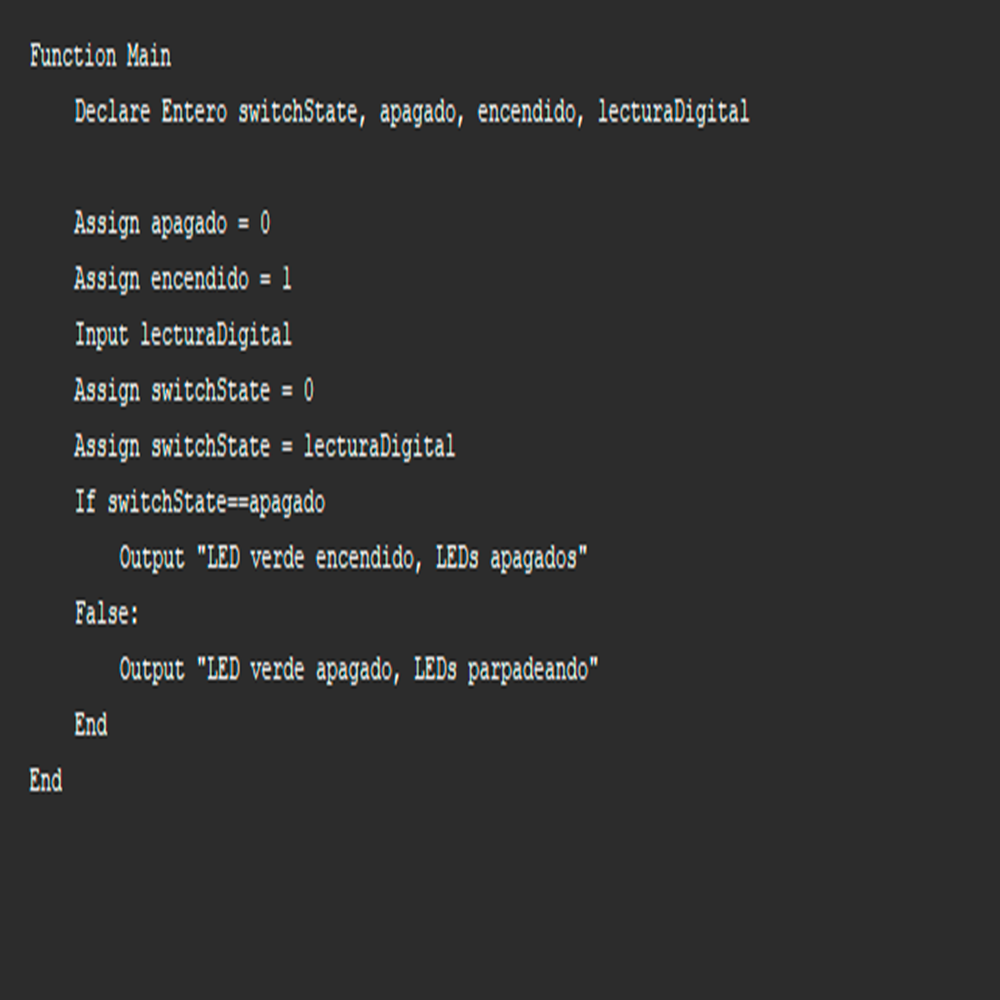
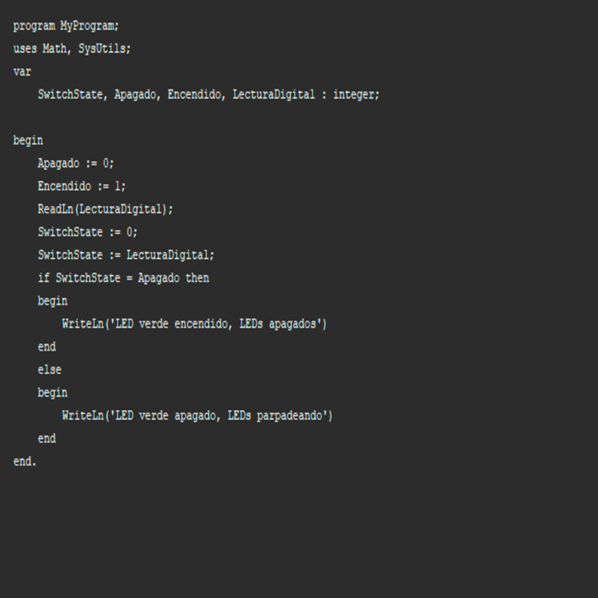

# 2.1 Introducción

:heavy_check_mark: :eyes: :point_right: **Objetivo:** Entenderemos el papel de los **algoritmos** como principio fundamental en la programación de computadoras.

- - -
 
### Contenido:

* Introducción 
* ¿Que entendemos por problema?
* Solución de problemas
    * Identificación del problema
    * Encontrar posibles soluciones
    * Diseño del método de resolución
* Diseño de algoritmos
    * ¿Que es un algoritmo?
        * ¿Que es un diagrama de flujo?
        * ¿Que es un pseudocodigo?
* Traducir el algoritmo
* Depurar el programa
* Mantenimiento del programa
* Referencias

- - -

## 2.1.1 Introducción

Crear un programa de computadora es un **proceso** que le indica a una computadora las instrucciones que debe ejecutar, la finalidad es resolver problemas específicos.

El **proceso** es el siguiente:

1. Solución de problemas
2. Diseño de algoritmos
3. Traducir el algoritmo
4. Depurar el programa
5. Mantenimiento del programa

- - -

## 2.1.2 ¿Que entendemos por problema?

Entendemos por **problema** una situación que debemos resolver debido a que las cosas que queremos son diferentes a las que tenemos, consiste en averiguar el modo de obtener un resultado o lo que queremos, teniendo en cuenta los datos disponibles.

- - -

## 2.1.3 Solución de problemas

El **análisis del problema** es un estudio profundo del problema y de la situación que lo rodea.

El programador debe reconocer y entender por completo cuál es el  problema identificando los datos disponibles y a qué resultados se desea llegar y proponer una solución para transformar los datos disponibles en resultados.

Los conceptos básicos para identificar las tareas que implica la resolución de problemas son los siguientes:

1. Iidentificación del problema
2. Encontrar posibles soluciones
3. Diseño del método de resolución

### Identificación del problema

Para **identificar el problema** es necesario analizar y entender completamente la situación que se desea resolver. Una manera de lograrlo es identificar los elementos importantes:

* Los elementos que tenemos disponibles.
* Los elementos que deseamos o que estan ausentes.

Después de **analizar** y **comprender** completamente la situación, define una respuesta a la pregunta:

¿Cual es el problema?

Ejemplo: 

El próximo mes estará a la venta el videojuego que quiero tener y no tengo dinero para comprarlo.

Datos disponibles:

* La venta del videojuego el próximo mes.
* Que no tengo dinero para comprar el videojuego.

Lo que se desea:

* Tener el videojuego.
* El dinero para comprar el videojuego.

¿Cuál es el problema?

* Que no tengo dinero para comprar el videojuego.

En esta situación en particular es sencillo identificar el problema, el problema es:

Que **no tengo dinero** para comprar el videojuego.

### Encontrar posibles soluciones

**Objetivo:** Definir qué necesitamos hacer para transformar lo que tenemos por lo que deseamos.

Es posible encontrar varias soluciones a un problema y seleccionar la mejor opción dependerá de las necesidades específicas.

Para encontrar **soluciones a un problema** analiza qué **acción** debemos realizar para eliminar la diferencia de lo que tenemos por lo que se desea.

Ejemplo:

En la situación anterior se identificó que el problema es:

Que **no tengo dinero** para comprar el videojuego.

Posibles soluciones:

* Pedir dinero prestado para comprar el videojuego.
* Buscar a un amigo que compre el videojuego y que quiera invitarme a jugar.
* Conseguir un empleo que nos permita trabajar y conseguir el dinero necesario para comprar el videojuego.

Vemos que la mejor y posiblemente la única solución para resolver nuestro problema es: 

Conseguir un empleo que nos permita **trabajar** y conseguir el dinero necesario. 

### Diseño del método de resolución

Saber cual es el problema y cómo resolverlo no es suficiente, no significa que logremos el objetivo, necesitamos diseñar una estrategia que transforme los elementos disponibles por lo que deseamos.

Ejemplo:

La solución a nuestro problema es conseguir un empleo y la estrategía  o los pasos que nos permitirá resolver el problema son:

* Ordenar nuestros documentos personales y laborales disponibles.
* Seleccionar la ropa para una entrevista laboral.
* Seleccionar posibles empleos.
* Realizar citas para entrevistas laborales.
* Acudir a las entrevistas laborales.
* Conseguir el empleo
* Trabajar mínimo durante un mes.
* Ahorrar el sueldo para juntar el dinero necesario y comprar el videojuego.
* Comprar el videojuego.

El **método de resolución** o **algoritmo** es la serie de pasos o instrucciones que permite alcanzar la solución de un problema.

- - -

## 2.1.4 Diseño de algoritmos

En **computación** para resolver un problema debemos transformar los datos disponibles o de entrada por resultados o datos de salida.

El **diseño de algoritmos** tiene un papel fundamental en la programación de computadoras. 

* Permite implementar la solución de problemas.
* Es la planeación de la estrategía para resolver el problema.
* Permite diseñar un algoritmo fácil de transcribir a un lenguaje de programación.

Para resolver problemas con una computadora debemos diseñar un algoritmo que sea fácil de transcribir a un lenguaje de programación.

Es importante mencionar que una computadora sólo maneja datos precisos con instrucciones objetivas y no ambiguas. Por otro lado, realiza una cantidad limitada de tareas, pero las hace muy bien y demasiado rápido si le proporcionamos las instrucciones adecuadas.

El programador debe planear la estrategía que permita alcanzar la solución de un problema.

### ¿Que es un algoritmo?

Un **algoritmo** es una lista de instrucciones ordenada lógicamente que permite resolver un problema.

Las **características fundamentales** de los algoritmos son las siguientes: 

* **Preciso:** Debe indicar claramente el orden en él que se deben realizar las instrucciones que permitan resolver el problema. 
* **Ordenado:** Se deben entender claramente las instrucciones y cada parte del algoritmo.   
* **Eficaz:** Las instrucciones del algoritmo deben ayudar a resolver el problema original.

Las **herramientas** y **técnicas** de diseño de algoritmos son las siguientes:

* Diagrama de flujo
* Pseudocódigo

#### ¿Que es un diagrama de flujo?

Un **diagrama de flujo** es la **representación gráfica** mediante símbolos especiales de los pasos o procedimientos de manera secuencial y lógica que se deben realizar para solucionar un problema.

Aquí el ejemplo de un diagrama de flujo.

#### ¿Que es un pseudocódigo?

Un **pseudocódigo**(falso lenguaje o lenguaje de descripción algorítmico) netamente un **lenguaje de tipo informático**, es redactar cada paso del algoritmo utilizando oraciones breves sin incluir adjetivos y artículos. En la práctica el pseudocódigo es más utilizado.

Aquí el ejemplo de un pseudocódigo.

Utilizar estas **herramientas** o **técnicas** facilita la transcripción de un algoritmo a un lenguaje de programación.

**Nota:** Aquí se describen los elementos para construir Algoritmos.

* :heavy_check_mark: :eyes: :point_right: [Algoritmos](https://github.com/DeveloperLuisF3/introduccionALaProgramacion/tree/main/procesoParaCrearProgramasDeComputadora/algoritmos "Ir a Algoritmos")

- - -

## 2.1.5 Traducir el algoritmo
 
La **programación** es transformar un problema en una serie de instrucciones que constituyen el programa de un ordenador.

El programador debe entender por completo los **fundamentos de los lenguajes de programación** y ser capaz de traducir el algoritmo diseñado a un lenguaje de programación y aplicarlo a una computadora.

**Nota:** *Próximamente → fundamentos de los lenguajes de programación.*

Aquí el ejemplo de un programa de computadora.

- - - 

## 2.1.6 Depurar el programa

**Depurar el programa** es corregir los errores que se presentan durante la ejecución de un programa. 

Existen dos tipos de errores:

* Sintaxis
* Lógicos

**Errores de sintaxis:** Son aquellos que se cometen cuando no se escribe correctamente la sentencia y el programa se ve interrumpido. 

**Errores lógicos:** Son aquellos que ocurren cuando no se obtienen los resultados esperados y el programa no se ve interrumpido, por lo que son difíciles de detectar.

El programador debe realizar **pruebas** que verifiquen el funcionamiento del programa para corregir posibles errores.

- - -

## 2.1.7 Mantenimiento del programa

El **mantenimiento del programa** es una actividad común en la ingeniería de software que consiste en **corregir** defectos encontrados durante su uso o la **adición** de nueva funcionalidad, **mejorando** el rendimiento y usabilidad del programa.

El programador debe modificar el programa según vayan apareciendo necesidades adicionales.

- - -

### 2.1.8 Referencias

**► Continuar con esta guía.**

* :heavy_check_mark: :eyes: :point_right: [Inicio](https://github.com/DeveloperLuisF3/introduccionALaProgramacion "Ir a inicio")

* :heavy_check_mark: :eyes: :point_right: [Proceso para crear programas de computadora](https://github.com/DeveloperLuisF3/introduccionALaProgramacion/tree/main/procesoParaCrearProgramasDeComputadora "Ir a Proceso para crear programas de computadora")

* :heavy_check_mark: :eyes: :point_right: Proximamente => Fundamentos de los lenguajes de programación
